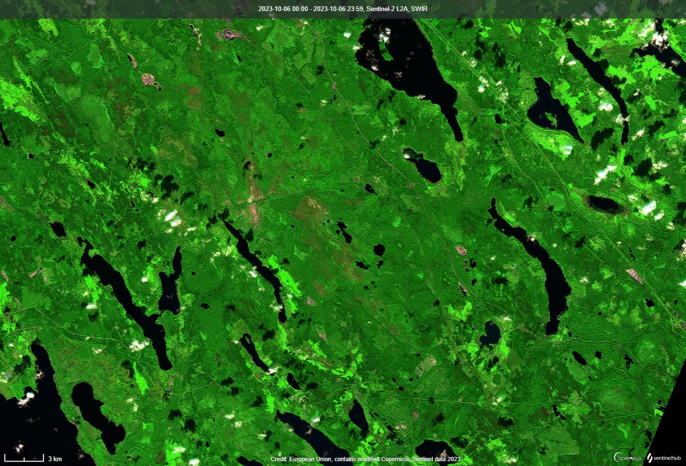

<!-- This is the markdown template for the final project of the Building AI course, 
created by Reaktor Innovations and University of Helsinki. 
Copy the template, paste it to your GitHub README and edit! -->

# Using AI in interpretation of satellite data

Final project for the Building AI course

## Summary

Remote sensing data has been available since invention of photography and manned flight. Observing the changes in Earth are becoming more and more important e.g. in undertanding climate change and its effects. Knowing how a geographic location has changed over time is very useful in cases like deforestation, desertification, change in build areas or military installations etc. The application areas are endless and the amount of data is HUGE. AI is used more and more also in this area. For example satellite imagery is being interpreted by artificial intelligence. IBM and NASA have created an open-source AI model for analyzing satellite data. This model is available on Hugging Face platform and was released in August 2023 (Source: https://newsroom.ibm.com/2023-08-03-IBM-and-NASA-Open-Source-Largest-Geospatial-AI-Foundation-Model-on-Hugging-Face). This project aims to give a short introduction to this topic.

## Background

Application area for analyzing and interpretation of remote sensing data is vast. In this introduction we concentrate on the burn scar detection. There is a demo of this available in the Huggin Face platform, which uses a model calle Prithvi. The user can also test the model with own data. A lot of fires rage arcoss different continents e.g. in Canada large areas burn every year - see for example: https://cwfis.cfs.nrcan.gc.ca/interactive-map OR NASA's FIRMS (Fire Information for Resource Management System). Personal interest comes from GIS (Geographic Information Systems) and my involment in this field. Due to this data from Earth is near to my heart. During recent years we've seen increase in fires due to the extreme droughts around the globe e.g. in Southwestern United States. Knowing which areas are affected is important for example for science. The Prithvi model ins diverse and can be trained to detect different things. Among these are are crop classification and floods from which there are also demos. 

## How is it used?

Describe the process of using the solution. In what kind situations is the solution needed (environment, time, etc.)? Who are the users, what kinds of needs should be taken into account?

The end users (govermental officials, researchers or other interested parties) need to provide an HLS geotiff image, including the following channels in reflectance units (e.g. 0-1): Blue, Green, Red, Narrow NIR, SWIR, SWIR 2. The input for the model is a color composite image in geotiff from channels mentioned previously. [Demo](https://huggingface.co/spaces/ibm-nasa-geospatial/Prithvi-100M-Burn-scars-demo) includes three test images to demostrate the model. Gathering and preprocessing suitable ("own") demo data is beyond the scope of this introduction.        

Below you can see an example of part of the possible input data for the model. A Sentinel-2 SWIR (Shortwave infrared) image with bands B12 (2190 nm), B8A (865 nm) and B4 (665 nm) that would be part of the input color composite (SWIR, Narrow NIR, Red) image. 

## Data sources and AI methods
User can get satellite data (in this case HLS) from various sources. Here are two examples: NASA's Earthdata (https://www.earthdata.nasa.gov/) and EU's Copernicus Data Space Ecosystem (https://dataspace.copernicus.eu/). Two useful tools under these sevices are the "Worldview" and "Browser". A word of warning... when the size of the geographical area grows. So does the data file size. More technical details about the data requirements for the Prithvi model can be found [here](https://huggingface.co/ibm-nasa-geospatial/Prithvi-100M-burn-scar). More details about the HLS data can be found here: [HLS data](https://www.earthdata.nasa.gov/esds/harmonized-landsat-sentinel-2#:~:text=The%20Harmonized%20Landsat%20Sentinel-2%20%28HLS%29%20project%20is%20an,product%20with%20observations%20every%20two%20to%20three%20days).

The model, Prithvi is a temporal Vision transformer pretrained by the IBM and NASA team on continental US HLS data. The model uses following AI methods or technologies:
* A self-supervised encoder developed with a ViT architecture
* Masked AutoEncoder (MAE) learning strategy, with an MSE loss function.
* The model includes spatial attention across multiple patches and also temporal attention for each patch. More technical details can be found
(Source: https://huggingface.co/ibm-nasa-geospatial/Prithvi-100M).

The model adopts a self-supervised encoder developed with a ViT architecture and Masked AutoEncoder (MAE) learning strategy, with an MSE loss function. The model includes spatial attention across multiple patches and also temporal attention for each patch.

## Challenges

The question that first comes to the mind is how well the Prithvi model for detecting burn scars would work e.g. Finland. The model is trained with data from continental US. It might be so that the model needs re-training with data from the boreal area in Finland or Scandinavia. The fires here are not so frequent so availability of data might also be an issue. 

## What next?

I've been contemplating the use of AI with images related to GIS for some time now. This course opened the possibility to get into it with more understanding and ideas - this assignement particular. In future it would be great to find time to gather satellite data from a recent burn area here in Finland and prepare the data for the model and test it raw. The next phase would be re-treining the model with Finnish (Scandinavian) data and see the difference in perfomance if any. In the bigger picture the use of AI methods with satellite data is still at it's early phases. It will probabaly bring a lot of added value alone in the amount processed data volume and time saved.  

## Acknowledgments

* The source of inspiration for the topic was the case during the course concerning the UNISEF school mapping
